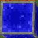

# CopperWire Mod
This mod gives you several new additions to Minecraft's redstone system:

## The New Components

* **CopperWire** - The core component. This is a Redstone Dust
compatible block that gives you 100% of the control over where it will connect. It also lets you allow 2 different
signals to cross within the same block, as well as run a signal up a wall. The biggest feature, however, is that it will
maintain the same redstone signal level for a full chunk before decaying. This allows for designing circuits that make
valuable use of the redstone signal level. With this, analog circuits are now possible.This can also be used to carry
the equivalent of 4 binary redstone signals on a single line! On top of all of that, Copper Wire can even be underwater!

* **CopperLantern** - This works parallel to a torch, except
that it can emit all redstone values. When mounted on a solid block, the torch gives off the inverse value of whatever
power is supplied to the block.

* **CopperLight** - Much like the Redstone Lamp, this light turns on
when supplied with a non-zero redstone signal. However, the color produced depends on the redstone signal value. That
makes this a 16 color light!

* **CopperPowerSource** - Imagine wrapping a Redstone
Block in copper wire and being able to control the redstone value it emits. That's precisely what this block is.

* **CopperPowerMeter** - Just set this block down beside
any piece of Redstone Dust or Copper Wire, and it will tell you what the current value is. It can even be placed on top
of dust and wires to get the value.

* **CopperDiode** - A Redstone Repeater is great for boosting the
redstone value to 15. In the same way, the Copper Diode boosts the signal being carried without modifying the redstone
value so that copper wire can carry the signal for another chunk.

* **CopperSignalLock** - This is a single component latch
designed after the repeater, only in reverse and with the ability to preserve whatever signal state it is fed. Feeding
any non-zero input into either side will enable the CopperSignalLock to store the signal state at it's input.

## How It Works
Copper Wire introduces a new state called a "step". When read from an active power source or redstone gate, this step
value is initialized to 15. Just as Redstone Dust loses 1 value point for each block that it carries a signal, Copper
Wire loses 1 step value for each block traveled. When the step value reaches 0, the next block will see the step go back
to 15 and the redstone value finally lose 1... unless losing 1 causes the redstone value to go to 0. In that case, step
will also be zero. Since the step value on Copper Wire does not affect the displayed state, and there are multiple
potential step values for each instance, the step value is not directly part of the state of the block. It is instead
kept in an entity that manages the multiple values that the block can maintain. This keeps the number of states from 
ballooning out of control and upping the memory requirements too much.

Both Copper Wire and Diode allow you to select which directions are active. Simply tapping use on that quadrant of the
block toggles the corresponding side on and off. With the Copper Wire, once all 4 sides are toggled on, tapping use on
the middle of the block will toggle "hop" mode, allowing the east/west direction to carry a different signal than the
north/south direction. Copper wire can also be placed on a block vertically above another piece of copper wire that is
vertical on that same side.

The Copper Power Meter and Source have the ability to emit/display the signal in copper step units as well as redstone
value units. The default is Redstone units. To display the signal in copper step units, put a switch on the side of the
block and turn it on.
